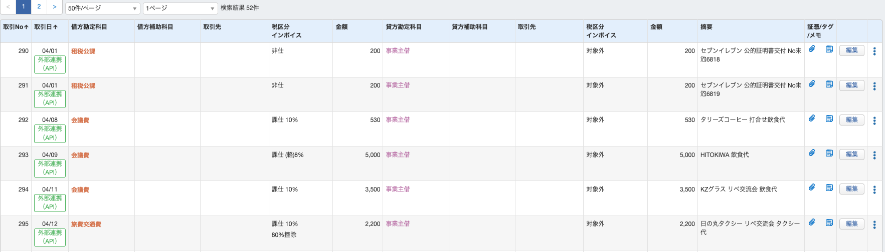
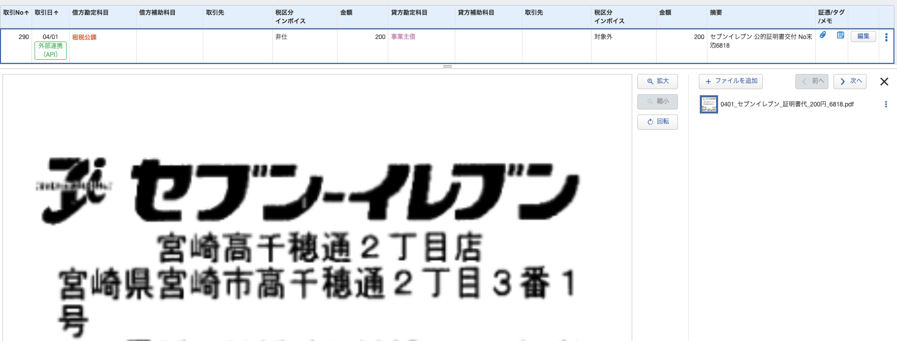
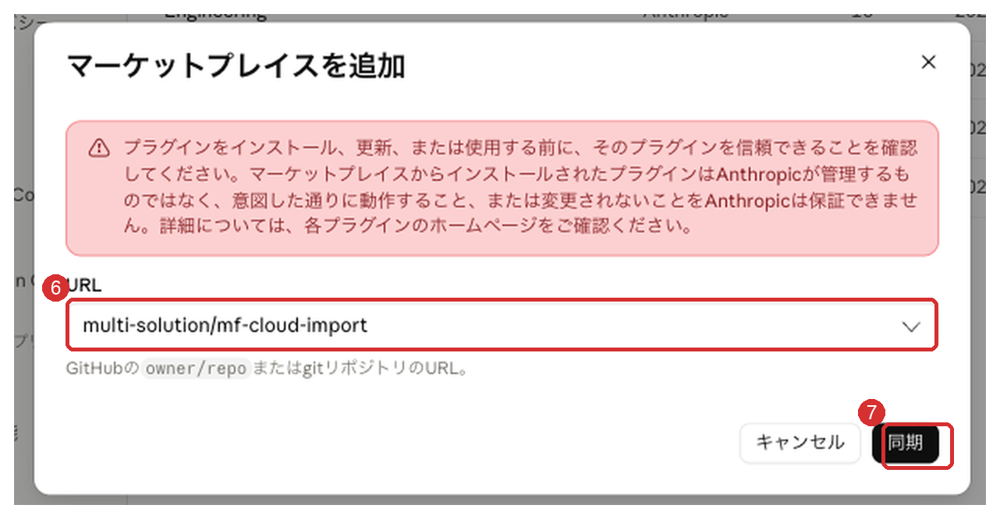

# mf-cloud-import

**領収書をフォルダに入れて「記帳して」と言うだけ。**
AIが読み取り、明細と突き合わせ、マネーフォワード クラウド会計へ記帳して、領収書を仕訳に添付します。



*↑ 実際の帳簿。「外部連携（API）」の行が、このプラグインが登録した仕訳です。勘定科目・税区分・インボイス区分（軽減8%・80%控除）まで判定されています。*

> ⚠️ **本プラグインは、株式会社マネーフォワードの公式製品ではありません。**
> 株式会社 multi-solution が独自に開発した**非公式**のツールです。
> 「マネーフォワード クラウド会計」は株式会社マネーフォワードの登録商標です。
> **【お問い合わせ先】** 本プラグインのご質問・不具合の報告は、**このリポジトリの Issues** へお願いします。
> 同社の製品ではないため、**マネーフォワード社ではお答えできません。**

## 使い方は4ステップ

| | やること |
|---|---|
| **1** | 領収書（PDF・写真）をフォルダに入れる。ファイル名は揃えなくて大丈夫です |
| **2** | Claude に「**記帳して**」と伝える |
| **3** | 確認表が出るので、内容を見る。直したい行はその場で伝えれば修正されます |
| **4** | 「**実行**」と答える。記帳と証憑の添付まで一度に終わります |

**ふだんは月に一度、まとめて実行するだけ**です。

### 証憑（領収書）も自動で添付されます



ファイル名は「日付＿相手先＿内容＿金額」に整えて保存します。あとから日付・取引先・金額のどれからでも探せます。


> 📘 **はじめての方へ**：専門用語を使わない手順書があります → **[導入マニュアル](docs/導入マニュアル.md)**
> （基本編20分で記帳の自動化まで。難しい工程は応用編に分けてあります）

## コマンドは3つだけ

| コマンド | 内容 |
|---|---|
| `/mf-cloud-import:mf-setup` | 初期設定。接続を診断し、**過去の仕訳から自分用の勘定科目ルールを作ります** |
| `/mf-cloud-import:mf-status` | いま何が終わって何が残っているかを1画面で表示（帳簿は変更しません） |
| `/mf-cloud-import:mf-import` | 領収書を読み取って記帳し、証憑を添付（承認制） |

## 設計の考え方

このプラグインは**機能の多さより「事故を起こさないこと」**を優先しています。

### 1. 証憑がない経費は記帳しない

領収書が手元にないものは、記帳せず「証憑待ち」として残します。
仕訳が存在するなら必ず証憑が付いている状態を保つためです
（後から「添付したのかしていないのか」が分からなくなるのを防ぎます）。

振込手数料・預金利息など**そもそも証憑が存在しないもの**は対象外です。

### 2. 同じ領収書を二度記帳できない

「記帳したらフォルダを移す」という運用は、移動を忘れた瞬間に破綻します。
そこで**ファイルの内容ハッシュ（SHA-256）で処理済みを管理**します。

**ファイル名を変えても、フォルダを移動しても、同じ領収書は記帳済みと判定されます。**

### 3. 危険な操作を構造的に避ける

- **売掛金の回収はAPIで仕訳しません。** MFの「実現」機能と紐付ける手段がAPIに無く、
  自動化すると二重計上になるためです。該当分は対応表を出してお渡しします
- 登録前に必ず承認を求めます。完全自動化はしません
- 毎回、事業者名を確認します（取り違えが最大の事故のため）

### 4. 利用者に合わせて表示が変わる

初期設定で「記帳の経験」を尋ね、表示を切り替えます。

- **会計に不慣れな方**：専門用語を避け、業務の実態を尋ねます
  （「会議費ですか交際費ですか」ではなく「どなたとの食事でしたか」）
- **経理経験者・税理士**：専門用語のまま、情報密度を優先して簡潔に表示します

**ただし安全装置（1〜3）は、どちらのモードでも一切緩みません。**

## 必要なもの

- **Claude Code**（ターミナル / デスクトップアプリ / IDE拡張のいずれか）
  - Claude のご契約が別途必要です（本プラグイン自体は無償ですが、Claude は無償ではありません）
  - **自分の帳簿だけに使うなら Pro / Max で十分**です。ただし学習利用の設定はご確認ください
  - **顧問先など他人のデータを扱う場合は、Team プラン以上**をおすすめします
  - → 詳しくは [データの扱い](#データの扱い)
- **Python 3.9 以上を推奨**（3.8でも動作確認済み。追加ライブラリ不要・標準ライブラリのみ）
- **マネーフォワード クラウド会計**のアカウント
- 証憑の自動添付を使う場合：**マネーフォワードの開発者アプリ登録**（後述）

> **Windowsをお使いの場合**：本書のコマンド例は `python3` ですが、Windowsでは
> `python` または `py` に読み替えてください。

## セットアップ

### 1. プラグインを入れる

**画面から入れる（おすすめ・ターミナル不要）**

設定 → **カスタマイズ → プラグイン** → 右上の **追加** → **マーケットプレイスを追加** → **リポジトリから追加**
URL欄に `multi-solution/mf-cloud-import` を入れて **同期** → 一覧の「Mf cloud import」をインストール → **Claude Code を再起動**



> 画面写真つきの詳しい手順は **[導入マニュアル](docs/導入マニュアル.md#step-3プラグインを入れる3分)** にあります。
> 「プラグインを信頼できることを確認してください」という赤い注意書きが出ますが、
> これはAnthropicが外部プラグインすべてに表示しているもので、エラーではありません。

**ターミナルから入れる**

```bash
claude plugin marketplace add multi-solution/mf-cloud-import
claude plugin install mf-cloud-import@mf-cloud-import
```

**チャット欄から入れる**（`/plugin` に対応している環境のみ）

```
/plugin marketplace add multi-solution/mf-cloud-import
/plugin install mf-cloud-import
```

> どの方法でも、**入れたあとに Claude Code の再起動**が必要です。
> `/plugin` は環境によって「isn't available in this environment」と出ます。その場合は上の2つをお使いください。

### 2. MFクラウドのコネクタに接続する

本プラグインは接続設定を**同梱していません**。マネーフォワード公式のClaudeコネクタを、
**ご自身のアカウントで**有効化してください（同じMFへの接続が2つできる事故と、
接続情報の第三者提供にあたる懸念を避けるためです）。

**方法A（推奨・画面で完結）**
claude.ai の「設定 → コネクタ」で **「マネーフォワード クラウド会計」** を追加し、
MFクラウドのアカウントで認可する。Claude Codeにも自動で反映されます。

**方法B（ターミナル）**

```bash
claude mcp add --transport http mfc_ca https://beta.mcp.developers.biz.moneyforward.com/mcp/ca/v3
```

> どちらの場合も、接続の認可はマネーフォワードの画面上でご自身が行います。
> 認可情報がプラグインや作者に渡ることはありません。

### 3. 証憑の自動添付を有効にする（任意）

証憑添付だけは会計REST APIを直接使うため、**ご自身での開発者アプリ登録**が必要です。

```bash
python3 <プラグインのパス>/scripts/oauth_init.py
```

認証情報は `~/.mfc/credentials.json` に保存されます。
**このファイルは作者に送られず、プラグインのログにも記録しません。**
読み書きするのは同梱のスクリプトだけで、クライアントシークレットやトークンを
Claudeとの会話に載せない設計です。
（※ 不具合の調査などで、このファイルを開くよう自分で指示した場合は、その内容も会話に含まれます）

> 顧問先を複数扱う場合は、**事業者ごとに認証情報と処理済み台帳を必ず分けてください。**

### 4. 初期設定

```
/mf-cloud-import:mf-setup
```

対話で設定を作り、`.mf-cloud/config.json` に保存します。
過去の仕訳から勘定科目ルールを生成できます（**許可を取ってから実行します**）。

### 5. まず少量で試す

**初回は領収書1〜2件で実行し、結果をMFクラウドの画面で確認してください。**
科目・税区分が意図どおりであることを確かめてから、まとめて処理することを
強くおすすめします（設定に誤りがあった場合の影響を最小にするためです）。

## データの扱い

**ここは必ずお読みください。** 顧問先や取引先の情報を扱う方には、特に重要です。

### 作者には送られません

このプラグインは外部サーバーを持ちません。**作者にデータが送信されることはありません。**
MFクラウドへの認可もあなた自身がマネーフォワードの画面で行うため、認可情報が作者に渡ることもありません。
MFクラウドへ送るのは、**あなたが承認した仕訳と証憑ファイル**だけです。

### ただし、Claude（Anthropic社）は経由します

Claude Code はあなたのパソコンで動きますが、**読み取りと判定はAnthropic社のクラウドで行われます。**
したがって、次のものがAnthropic社のサービスへ送信されます。

- 領収書の中身
- **事業者名**（取り違えを防ぐため毎回確認します）
- 銀行・クレジットカードの連携明細
- 過去の仕訳・取引先マスタ・勘定科目
- 作業しているフォルダのパス

**領収書だけが送られるのではありません。** 突合と科目判定のために、帳簿の広い範囲が文脈に含まれます。
これはAIで記帳する以上、避けられない性質のものです。

### だから、契約と設定で担保してください

| ご契約 | 学習に使われるか | 保存期間 | 組織としての統制 |
|---|---|---|---|
| Free / Pro / Max（個人契約） | **設定次第** | 30日（学習を許可すると**5年**） | できない |
| Team / Enterprise / API（商用） | 使われない | 30日 | できる |
| Enterprise ＋ ゼロデータ保持 | 使われない | **保存しない** | できる |

**自分の帳簿だけに使う場合**（個人事業主・自社の経理）
→ **Pro / Max で十分です。**ただし [プライバシー設定](https://claude.ai/settings/data-privacy-controls) で
モデル改善へのデータ利用を**オフ**にしてください（オフなら保持30日、オンだと5年です）。
自分のデータをどう扱うかは、ご自身で決められる範囲の話です。

**他人のデータを扱う場合**（税理士・記帳代行・複数の会社の経理）
→ **Team プラン以上をおすすめします。**個人向けプランは、組織として設定を統制できないためです。
守秘義務を負うお立場の方は、所属会のガイドラインと、依頼元への説明の要否も併せてご確認ください。

### 手元にも記録が残ります

Claude Code は会話の記録を `~/.claude/projects/` に**平文で30日間**保存します。
パソコンのディスク暗号化（FileVault / BitLocker）を有効にし、必要なら保持日数を短くしてください。

### 意図せず送信してしまう経路

次の3つは、操作すると会話の内容がAnthropic社へ送られます。他者のデータを扱う環境では、止めることを検討してください。

| 経路 | 保持期間 | 止め方 |
|---|---|---|
| `/feedback` コマンド | 5年 | `DISABLE_FEEDBACK_COMMAND=1` |
| セッション品質調査で「Yes」を選ぶ | 6か月 | `CLAUDE_CODE_DISABLE_FEEDBACK_SURVEY=1` |
| エラーレポート（Pro / Max は既定でオン） | — | `DISABLE_ERROR_REPORTING=1` |

まとめて止める場合は `CLAUDE_CODE_DISABLE_NONESSENTIAL_TRAFFIC=1` を設定します。

> 詳細は Anthropic の公式ドキュメント [データ使用](https://code.claude.com/docs/ja/data-usage) をご確認ください。
> 税理士・社会保険労務士など**守秘義務を負う立場で顧問先のデータを扱う場合は、所属会のガイドラインと、
> 顧問先への説明の要否を必ずご確認ください。** 本プラグインはその判断を代替するものではありません。

## 制限事項

- **売掛金の消し込み（実現）は自動化できません**（APIに該当機能がないため）
- **3行以上の複合仕訳は明細から直接作れません**（源泉徴収を伴う入金など）。
  画面での手動操作か、API2本立てかを選んでいただきます
- **証憑の中身はAPIで読めません**（アップロードと削除のみ対応）
- 1回の実行で扱えるのは**30ファイルまで**（超えると読み取り精度が落ちるため）
- コネクタはベータ版のエンドポイントを利用しています。仕様変更の可能性があります

## トラブルシューティング

**Q. スクリプト実行時に「Operation not permitted」や許可の確認が出る**
Claude Codeのサンドボックスが `~/.mfc/`（認証情報）へのアクセスを制限しているためです。
表示される許可プロンプトを承認してください。毎回の承認を避けたい場合は
`/sandbox` コマンドで設定を調整できます。

**Q. なぜOAuth（ブラウザでの認可）が必要なのか。APIキーで済ませられないのか**
マネーフォワードにはAPIキー認証もありますが、**2026年8月時点でクラウド会計はAPIキーの対象外**です
（発行画面で選べるのは「事業者情報」「クラウド連結会計」のみ・実測確認済み）。
そのため証憑添付が使う会計APIはOAuthが唯一の手段です。将来対応された場合は移行を検討します。

**Q. 認可の途中で「404 File not found」のページが出る**
コールバック用のポート（既定8765）を**別のプログラムが先に使っている**と起こります
（例：`python -m http.server 8765` で立てたプレビューサーバーの消し忘れ。実際に発生した事例です）。
この状態で「許可」を押すと認可コードが失われます。
`reauth.py` / `oauth_init.py` は起動時にポートの占有を検知して占有プロセスを表示するので、
表示されたプロセスを終了してから再実行してください。

**Q. preflight が繰り返し `expired` になる**
マネーフォワードのリフレッシュトークンは更新のたびに新しいものへ入れ替わります（ローテーション）。
次の場合に古いトークンが無効化され、`expired` になります。

- 同じClient IDで**認可（oauth_init.py）をやり直した**：以前のトークンは無効になります
- **複数のパソコン・複数の認証ファイル**で同じClient IDを使っている：
  片方の更新でもう片方が無効になります

対処：**`reauth.py` を実行**してください（保存済みのClient ID/Secretを再利用するため、
ブラウザで「許可」を押すだけで復旧します。Client ID/Secretの再入力は不要です）。
複数環境で使う場合は、環境ごとに別のアプリ（Client ID）を登録することを推奨します。

**Q. 複数の会社・事業者の帳簿を扱いたい**
事業者ごとに次の3つを**必ず分けてください**。

1. 認証ファイル：`oauth_init.py --creds ~/.mfc/credentials_◯◯.json`
2. 設定と台帳：事業者ごとのフォルダに `.mf-cloud/`（config.json・ledger.json）
3. セッション：作業も事業者ごとに分ける

プラグインは実行のたびに「MCP接続先」「REST認証」「設定ファイル」の事業者名が
一致するかを突合し、不一致なら停止します。

**Q. Googleドライブ等の同期フォルダで使ってよいか**
証憑の置き場所としては問題ありません。ただし台帳（`.mf-cloud/ledger.json`）を
複数端末から同時に更新すると競合するため、**記帳作業は1台ずつ**行ってください。

## ⚠️ 免責事項

- **本プラグインの役割は「記録の作成を補助すること」に限られます。**
  税務相談・税務代理はいたしません。勘定科目・税区分・インボイス区分の判定は**参考情報**です。
  **最終的な確認と判断は、利用者ご自身または顧問税理士が行ってください。**
- 本プラグインの利用によって生じたいかなる損害についても、作者は責任を負いません。
- 記帳した内容は、**必ずマネーフォワード クラウド会計の画面でご確認ください。**
- 税制・会計基準・API仕様は変更されます。本プラグインの内容が
  最新の制度に対応していることを保証するものではありません。
- **電子帳簿保存法への適合は、利用者ご自身の責任でご判断ください。**
  適合は、証憑の保存場所やご運用の全体で決まるものです。本プラグインが行うのは
  「ファイル名を探しやすい形に整えること」までで、**適合の保証は含みません。**
- **本プラグインは株式会社マネーフォワードの公式製品ではなく、同社とは無関係に開発されたものです。**
  同社は本プラグインについて一切の責任を負わず、**お問い合わせにもお答えできません。**
- 「マネーフォワード クラウド会計」は株式会社マネーフォワードの登録商標です。
- 連携に用いるコネクタはベータ版として提供されているため、仕様が変更される可能性があります。

## ライセンス

MIT License

---

このプラグインは、実際の個人事業の帳簿で運用しながら作られました。
記載されている「やってはいけないこと」は、**実際に起きた事故に基づいています。**
