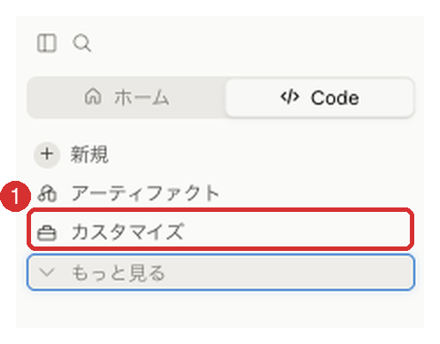
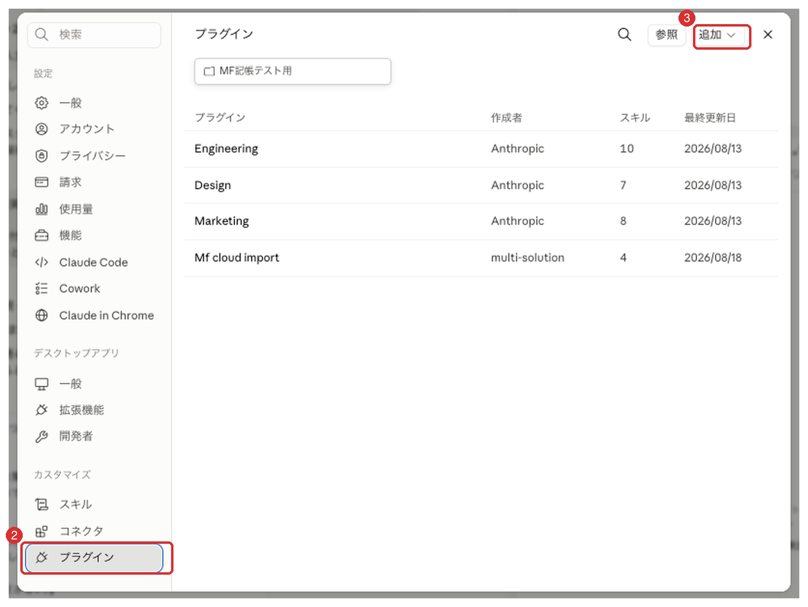
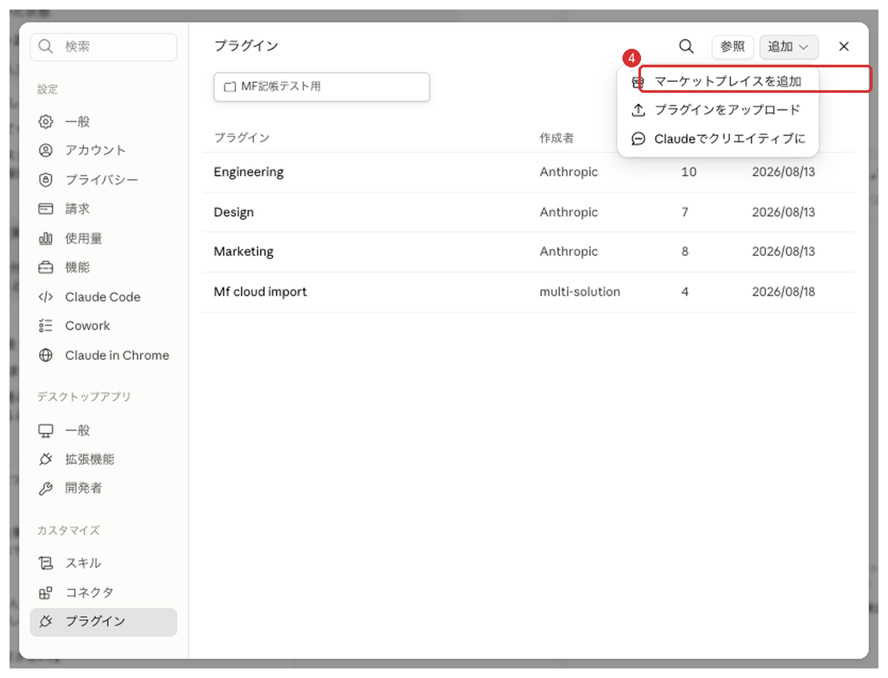
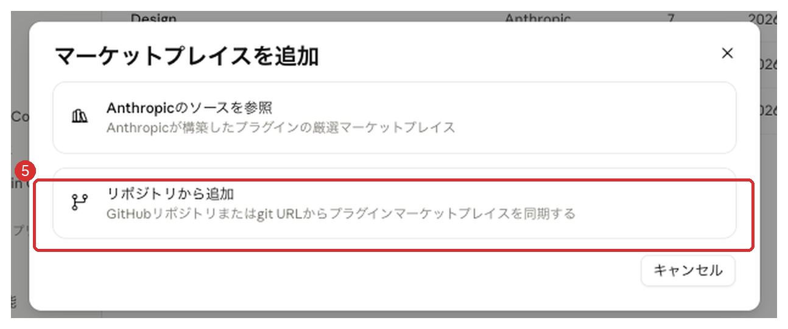
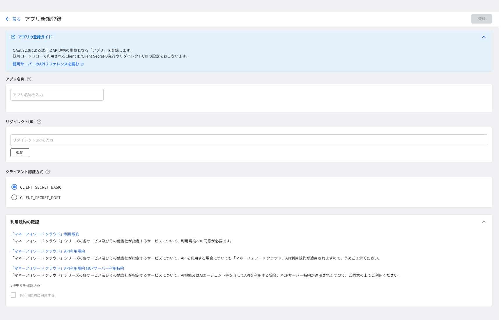
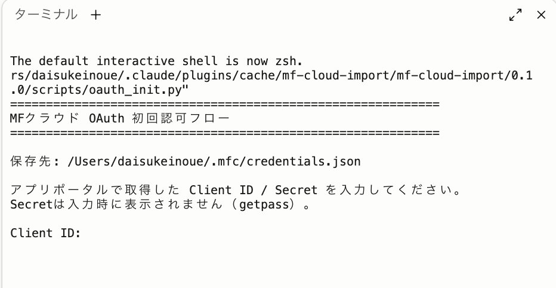

# mf-cloud-import 導入マニュアル

**〜 領収書の記帳を、Claudeにまかせるまでの手順書 〜**

> ⚠️ **このプラグインは、株式会社マネーフォワードの公式のものではありません。**
> 株式会社 multi-solution が独自に作った**非公式**のツールです。
> 「マネーフォワード クラウド会計」は株式会社マネーフォワードの登録商標です。
> **【お問い合わせ先】** このプラグインのご質問・不具合の報告は、**GitHubリポジトリの Issues** へお願いします。
> 同社の製品ではないため、**マネーフォワード社ではお答えできません。**

---

## このプラグインでできること

1. フォルダに入れた領収書（PDF・写真）をClaudeが読み取り、**マネーフォワード クラウド会計へ記帳**します
2. 銀行・カードの明細と領収書を突き合わせ、**経費の種類（勘定科目）も判定**します
3. 記帳した仕訳に**領収書を自動で添付**します（ファイル名も「日付＿相手先＿内容＿金額」に整えます）

あなたがやることは、領収書をフォルダに入れて「記帳して」と言い、内容を確認して「実行」と答えるだけです。**確認なしに帳簿に書き込まれることはありません。**

## 導入は2段階です

| | できるようになること | 所要時間 | 難しさ |
|---|---|---|---|
| **基本編** | 記帳の自動化（上の1と2） | 約20分（Git・Pythonの準備が要る場合は＋20分） | かんたん。**ほぼ画面の操作だけ**で終わります（Git・Pythonが未導入の場合のみ、コマンドを数行入力します） |
| **応用編** | 領収書の自動添付（上の3） | 約30分 | **少し難しい**。MFの開発者向け画面での作業あり |

> 💡 **まず基本編だけで使い始めてOKです。**
> 応用編を飛ばした場合、領収書の添付だけMFクラウドの画面で手作業になりますが、それ以外はすべて動きます。応用編は後からいつでも追加できます。

## 事前に必要なもの

- [ ] パソコン（Mac または Windows）
- [ ] **Claude の有料プラン**（Claude Code が使えるプラン）
      ※ **自分の帳簿だけに使うなら Pro / Max で十分**です
      ※ **顧問先など他人のデータを扱う方は Team プラン以上**をおすすめします（→「データがどこへ行くか」）
- [ ] **マネーフォワード クラウド会計**の契約（ご自身の事業で使っているもの）
- [ ] **Git** と **Python**（どちらも無料。入っていない場合の入れ方は基本編 Step 1-2 で説明しています）

---

# 基本編（約20分）

## Step 1：Claude Code と、必要な道具を入れる（5〜25分）

すでに Claude Code をお使いの方は、**1-2 の確認だけ**行ってください。

### 1-1. Claude Code を入れる

1. https://claude.ai/download からデスクトップアプリをダウンロードしてインストール
2. 起動して、Claudeのアカウントでログイン

### 1-2. Git と Python を用意する（初回のみ）

このプラグインは、裏で2つの無料ツールを使います。

| ツール | 何に使うか |
|---|---|
| **Git** | プラグインを GitHub から取り込むとき（Step 3） |
| **Python** | 二重記帳を防ぐ台帳の照合と、領収書の自動添付（応用編） |

**まず、すでに入っているかを確認します。**

ターミナルを開きます（Claude Code の画面右上の `>_` ボタン。見当たらなければ、Mac は Launchpad で「ターミナル」、Windows はスタートメニューで「PowerShell」を検索）。

次の2行を、1行ずつ貼り付けて Enter を押します。

```bash
git --version
python3 --version
```

どちらも `git version 2.39.5` や `Python 3.9.6` のように**数字が表示されれば、準備は完了**です。Step 2 へ進んでください。

表示されなかった場合は、お使いのパソコンに合わせて次の手順で入れます。

#### Mac の場合（1回で両方そろいます）

Mac の Git と Python は、Apple 公式の無料パッケージ「**コマンドライン・デベロッパ・ツール**」にまとめて入っています。

1. ターミナルに次の1行を貼り付けて Enter

   ```bash
   xcode-select --install
   ```

2. インストールするか確認する画面が出るので、「**インストール**」を押す
3. 使用許諾の画面で「**同意する**」を押す
4. 完了まで待つ（回線によって**数分〜20分ほど**）
5. もう一度 `git --version` と `python3 --version` を実行し、数字が出ることを確認

> 💡 確認のコマンドを打った時点で、同じインストール画面が出ることがあります。**エラーではありません**。
> そのまま「インストール」を押せば、同じものが入ります。

#### Windows の場合（Git と Python を別々に入れます）

**① Git を入れる**

1. https://git-scm.com/install/windows を開き、「**Git for Windows/x64 Setup**」をダウンロードして実行
   （ARM 版の Windows をお使いの場合は「ARM64 Setup」）
2. 「このアプリがデバイスに変更を加えることを許可しますか？」と出たら「**はい**」
3. 設定の画面がいくつも出ますが、**すべて初期設定のまま**「Next」で進めて大丈夫です。最後に「Install」→「Finish」

**② Python を入れる**

1. **Microsoft Store** を開き、「**Python Install Manager**」を検索してインストール
   （python.org の従来型インストーラー（完了画面に「Setup was successful」と出るもの）では `python3` が使えません。**必ず Microsoft Store から**入れてください）

**③ Claude Code を再起動する**

一度終了して開き直してください。新しく入れた Git と Python を認識させるためです。

**④ 入ったことを確認する**

ターミナルで `git --version` と `python3 --version` を実行します。
**Python は初回だけ、最新版が自動でダウンロードされます**。途中で PATH（パス）に追加するか聞かれたら、「**Y**」で進めてください。

> ⚠️ **python.org の従来型インストーラー（Install Manager ではない方）で入れた Python は、`python3` という名前で呼べないことがあります。**
> その場合も、Python Install Manager を**追加で**入れれば解決します（入れた Python はそのまま使えます）。

> ⚠️ **Windows での動作は、まだ十分に確認できていません。**
> 手順どおりに進まない場合は、[Issues](https://github.com/multi-solution/mf-cloud-import/issues) で教えてください。

## Step 2：MFクラウドと接続する（5分）

Claudeがあなたの帳簿を読み書きできるように、マネーフォワード公式の「コネクタ」を有効にします。

1. ブラウザで claude.ai を開き、**設定 → コネクタ** へ
2. 一覧から **「マネーフォワード クラウド会計」** を探して追加
3. マネーフォワードのログイン画面が出るので、ログインして「**許可**」を押す

これだけです。認可はマネーフォワードの画面上であなた自身が行うので、パスワードなどが第三者に渡ることはありません。

> ⚠️ 事業者（会社）を複数お持ちの方は、このあと**どの事業者の帳簿につながっているか**を必ず確認します（初期設定で自動チェックされます）。

### 法人でお使いの場合（追加の手順）

**法人の事業者は、そのままでは連携できません。**「アプリ連携権限が必要です」というエラーが出ます。
個人事業では出ないため、法人で使う方だけがここでつまずきます。

**手順**

1. マネーフォワードの **[アプリポータル](https://app-portal.moneyforward.com/)** を開く
2. 右上の事業者が**法人になっているか確認**（違えば切り替える）
3. 左メニューの 「**ユーザー**」 → ご自身の名前をクリック
4. 右上の **「編集」** を押す
5. **「アプリ連携権限」** の中の **「アプリ連携」** にチェック
6. さらに、その下から次の2つにチェック
   - **事業者情報**
   - **クラウド会計・確定申告**
7. **保存**

そのあと、Step 2 の接続をやり直してください。エラーが消えます。

> 💡 **「連携中アプリ」を見に行っても解決しません**。あそこは連携済みアプリの一覧なので、
> まだ何もつないでいない状態では空っぽです。設定するのは「ユーザー」の権限です。

> 💡 **「システム管理」権限を持っていても足りません**。アプリ連携は独立した権限として分かれています。

> 💡 チェックは**必要な2つだけ**で十分です。給与・勤怠・人事などにチェックを入れる必要はありません。
> 万一のときの影響範囲を小さくするため、最小限にしておくことをおすすめします。

### 事業者を切り替えるとき

**MFクラウドの画面で事業者を切り替えても、Claude側の接続先は変わりません。**
接続先は「認可したときの事業者」に固定されます（実測で確認済み）。

切り替えるには、**claude.ai の「設定 → コネクタ」で一度切断し、つなぎ直す**必要があります。
公式コネクタは**1つしか登録できない**ため、複数の事業者を同時に持つことはできません。

## Step 3：プラグインを入れる（3分）

**画面をクリックするだけで入ります。ターミナルは使いません。**
下の画像の**赤枠と番号（1〜7）の順**に押していけば完了します。

### 3-1. 「カスタマイズ」を開く

左のメニューから **1「カスタマイズ」** をクリックします。




### 3-2. 「プラグイン」を開いて「追加」を押す

左下の **2「プラグイン」** をクリックし、右上の **3「追加」** を押します。




### 3-3. 「マーケットプレイスを追加」を選ぶ

**4「マーケットプレイスを追加」** をクリックします。

> その下の「プラグインをアップロード」ではありません。**ここを間違えると、あとで更新が届かなくなります。**




### 3-4. 「リポジトリから追加」を選ぶ

**5「リポジトリから追加」** をクリックします。




### 3-5. 配布ページの名前を入れて「同期」

**6 のURL欄**に、次の文字列をコピペします。

```
multi-solution/mf-cloud-import
```

入れ終わったら **7「同期」** を押します。


> **赤い注意書きが出ますが、エラーではありません。**
> 「プラグインを信頼できることを確認してください」という案内で、Anthropicが**外部プラグインすべてに表示している**ものです。
> 「作った人を信頼できるか、ご自分で確かめてください」という意味です。
> 本プラグインは**中身をすべて公開**していますので、ご不安な場合はソースコードをご確認ください。

### 3-6. 一覧からインストールする

一覧に **「Mf cloud import」（作成者：multi-solution）** が現れます。
これをクリックして、インストールしてください。

### 3-7. Claude Code を再起動する

**再起動しないとコマンドが出てきません。** 一度終了して、開き直してください。

再起動できたら、チャット欄に `/` を打ってみてください。
**`mf-setup` `mf-status` `mf-import`** の3つが候補に出れば成功です。

---

> **参考：ターミナルから入れる方法**（画面の操作がうまくいかない場合）
>
> ```bash
> claude plugin marketplace add multi-solution/mf-cloud-import
> claude plugin install mf-cloud-import@mf-cloud-import
> ```
>
> 入ったかどうかは `claude plugin list` で確認できます（`Status: ✔ enabled` と出ればOK）。

## Step 4：領収書を置くフォルダを決める（2分）

**置き場所で動きが変わります**。ここだけは少し丁寧に決めてください。

### 事業者ごとに「親フォルダ」を1つ作る

```
株式会社◯◯/              ← Claude Code で開くのはここ
├── 2026年度/
│    ├── 04月/
│    ├── 05月/
│    └── …
└── 2027年度/             ← 期が変わったら足すだけ
```

設定と台帳（`.mf-cloud`）は、**この親フォルダの直下**に作られます。
台帳は**上のフォルダへ遡って探す**ので、**配下のどこで作業しても同じ設定・台帳が使われます。**

> ⚠️ **年度フォルダの中で初期設定をしないでください。**
> 翌年また設定し直すことになり、年度をまたいだ二重記帳も防げなくなります。

> ⚠️ **事業者ごとに必ず別のフォルダにしてください。**（法人・個人事業・顧問先ごと）
> 設定を共有すると、除外ルールの流用で経費が丸ごと計上漏れになります。

### フォルダの分け方は「月」だけにする

| ❌ やらないこと | なぜ |
|---|---|
| 「記帳済み」「未処理」で分ける | **移動を1回忘れた瞬間に二重計上**。記帳済みかどうかは台帳が判定します |
| カード用・現金用で分ける | 分類を間違えると、そのまま貸方の間違いになります |
| 引落月で分ける | 仕訳の日付とズレて、後から探せなくなります |

**月は「使った日・決済した日」で決めます**。カードの引落日ではありません。

### ファイル名

`日付_相手先_金額.pdf` にしておくと、明細との突合が目で一瞬になります（例：`20260529_ココナラ_105500.pdf`）。

ただし**ファイル名は記帳済みの判定には一切影響しません**（ファイルの中身で判定するため）。
後からまとめて変えても、判定は狂いません。

### Claude Code でフォルダを開く

**親フォルダ**を開いてください（Claude Codeの「フォルダを開く」から選択）。
以後、経理の作業はこの中で行います。月フォルダの中で作業しても構いません。

## Step 5：初期設定をする（5〜10分）

チャット欄に次を送信します。

```
/mf-cloud-import:mf-setup
```

あとは**Claudeからの質問に答えていくだけ**です。全部選択式で、会計の専門用語は出てきません。実際にはこんな流れになります。

> **Claude**：診断が終わりました。
> ✅ MFクラウド接続 OK（事業者：あなたの屋号／個人事業・2026年度）
> この事業者に記帳します。合っていますか？
>
> **あなた**：はい
>
> **Claude**：記帳のご経験について教えてください。
> 1. あまり慣れていない　2. 経理の実務経験がある　3. 税理士・会計事務所です
>
> **あなた**：1
>
> **Claude**：事業のお金とプライベートのお金は分けていますか？
> 1. 分けていない　2. 事業用の口座・カードから払っている …
>
> **あなた**：1

途中でこんな提案もあります。**これがこのプラグインの目玉です。**

> **Claude**：過去1年分の仕訳を読んで、「この店ならこの経費の種類」というルールを自動で作れます。読み取ってよろしいですか？（帳簿は変更しません）
>
> **あなた**：はい
>
> **Claude**：過去1年の仕訳から、次のルールを作れます。
> ✅ 「◯◯モバイル」→ 通信費（12件中12件がこの科目）
> ✅ 「△△文具店」→ 消耗品費（8件中8件）
> ※過去の仕訳が誤っていた場合、その誤りを引き継ぎます。ご確認ください。

「設定が完了しました」と出たら基本編は終わりです。

## Step 6：まず領収書1〜2枚で試す（5分）

> ⚠️ **最初から領収書を全部入れないでください。** 設定に思い違いがあった場合の影響を最小にするため、まず1〜2枚で「意図どおりに記帳されるか」を確かめます。

1. 領収書のPDFか写真を**1〜2枚だけ**フォルダに入れる
2. チャットで送信：

```
/mf-cloud-import:mf-import
```

3. Claudeが読み取って、**記帳する前に必ず内容の確認表**を出します：

> **Claude**：これから記帳します。内容をご確認ください。
> ■ 記帳するもの（1件）
> 　7/21 ◯◯文具店 1,280円
> 　経費の種類：消耗品費 ／ 消費税10%あり ／ 領収書あり ✅
> 上記を記帳してよろしいですか？

4. 内容が正しければ「**実行**」と返信
5. **マネーフォワード クラウド会計の画面を開いて**、仕訳が意図どおりか確認する

問題なければ、次回からまとめて処理できます（1回につき30枚まで）。

## ふだんの使い方（導入後の毎月の流れ）

```
領収書をフォルダに入れる
  → 「/mf-cloud-import:mf-import」（または「記帳して」）
  → 確認表を見て「実行」
  → 終わり
```

いま何が残っているか知りたいときは：

```
/mf-cloud-import:mf-status
```

## 実際に使うときの注意（2つだけ）

実運用で見つかった落とし穴です。**どちらも二重計上につながります。**

### ① 同じ取引で「請求書」と「領収書」が2つあるとき

```
20260702_ChatGPT(請求書).pdf
20260702_ChatGPT(領収書).pdf   ← 同じ取引
```

**このパターンは、二重記帳の台帳では防げません**。台帳はファイルの中身で判定するため、
請求書と領収書は別ファイル＝別のものとして「どちらも未記帳」に見えます。
片方ずつ記帳すると、同じ経費が2回計上されます。

**対処**：連携明細のある取引は、**明細1件に対して証憑を1つだけ紐づけます。**
明細を起点にすれば、証憑が2ファイルあっても仕訳は1本にしかなりません。
もう片方は、同じ仕訳番号で台帳に記録しておくと、未記帳リストに残り続けません。

### ② ファイル名の日付が、実際の決済日とは限らない

```
20260820_動画制作.pdf   ← ファイル名は 8/20
                          実際の決済日は 5/29（3か月ずれる）
```

サービスによっては、**ダウンロードした日**がファイル名に入ります。
その日付で記帳すると、**まったく違う月に計上**されます。

**対処**：日付は**領収書の中身に書かれた決済日**で判断します。本プラグインもそうしています。
ファイル名は当てにしないでください。

---

# 応用編：領収書の自動添付（約30分）

> ⚠️ **ここは少し難しいです。飛ばしても基本編の機能はすべて使えます。**
> 難しさの正体は、マネーフォワードの「**開発者向け画面**」でアプリ登録という作業が必要なことです。開発の知識は不要ですが、見慣れない画面と英単語が出てきます。この手順書のとおりに進めれば大丈夫です。

**先に、つまずきやすいポイントを5つ予告します。**

1. 「開発者向け」という言葉が出てきますが、**開発はしません**。登録するだけです
2. 「リダイレクトURI」という入力欄には、**下に書いた文字を1文字も変えずコピペ**します
3. 「クライアント認証方式」は**初期値のままでは動きません**。`CLIENT_SECRET_POST` に選び直します
4. 「クライアントシークレット」は**一度しか表示されないことがあります**。表示されたらすぐ次の手順へ
5. 最後の「許可」ボタンの前に、**他のプログラムがポート8765を使っていると失敗**します（スクリプトが自動で検知してお知らせします）

## Step A：アプリポータルにログインする

ブラウザで **https://app-portal.moneyforward.com/** を開き、マネーフォワードのアカウントでログインします。

## Step B：アプリを登録する

左メニューの **「アプリ開発」** を開き、右上の **「新規登録」** を押します。
入力する項目は**3つだけ**です。

| 入力欄 | 入力する値 |
|---|---|
| アプリ名称 | 自由（例：`mf-cloud-import 証憑添付`） |
| リダイレクトURI | `http://localhost:8765/callback` ← **1文字も変えずコピペ**して「追加」を押す |
| クライアント認証方式 | **CLIENT_SECRET_POST** ← **初期値は BASIC です。必ず選び直してください** |



そのあと、いちばん下の **「利用規約の確認」** に進みます。
3件のリンク（クラウド利用規約／API利用規約／**MCPサーバー利用特約**）を開いて確認すると
「3件中 ◯件 確認済み」の数字が増え、**「各利用規約に同意する」にチェックが入れられるようになります**。
チェックを入れると、右上の「登録」ボタンが押せるようになります。

> 💡 **権限（スコープ）を選ぶ画面はありません。**
> 必要な権限は、次の Step C で実行するスクリプトが**認可のときにまとめて要求します**（全13件）。
> 何を渡すことになるかは、ブラウザに出る認可画面で確認できます。おもなものは
> 仕訳の読み取り・書き込み、**証憑の書き込み**（領収書添付の本体）、勘定科目・税区分・補助科目の読み取りです。

登録が終わると **Client ID** と **Client Secret** という2つの文字列が表示されます。**この画面を開いたまま**次へ進んでください。

> ⚠️ **複数の事業者（法人・個人事業・顧問先）を扱う場合は、事業者ごとにアプリを登録してください。**
> 1つのアプリを使い回すと、片方を使うたびにもう片方の認証が切れることがあります。
> アプリ登録の画面は、**その事業者に切り替えた状態**で開いてください。

## Step C：認可を通す（ターミナルで1行）

ターミナルは **Claude Code の中で開けます**。別のアプリを探す必要はありません。

**1. Claude Code の右上にある `>_`（ターミナル）ボタンを押します**


画面の右側にターミナルが開きます。

**2. 次の1行を貼り付けて Enter**

```bash
python3 ＜プラグインのインストール先＞/scripts/oauth_init.py
```

> 💡 インストール先が分からなければ、Claude Codeのチャットに
> 「**oauth_init.py のフルパスを教えて**」と送ってください。そのまま貼り付けられる形で返してくれます。

**複数の事業者を扱う場合**は、認証ファイルを事業者ごとに分けます。

```bash
python3 ＜インストール先＞/scripts/oauth_init.py --creds ~/.mfc/credentials_法人.json
```

**3. この画面が出れば起動成功です**



**4. 続きを入力します**

1. `Client ID:` と聞かれたら、Step Bの画面からコピーして貼り付けてEnter
2. `Client Secret:` も同様に（**画面には何も表示されませんが、ちゃんと入力されています**）
   - **Windows では、Ctrl+V ではなく右クリックで貼り付けてください。** Ctrl+V だと貼り付けにならず見えない文字が入り、あとで「client secret … does not match」というエラーになります（Mac は Cmd+V で大丈夫です）
3. ブラウザが自動で開きます

> ⚠️ **「許可」を押す前に、画面に出ている事業者名を必ず確認してください。**
> ここで違う事業者のまま許可すると、**記帳先と領収書の添付先が別々の事業者**になります。
> 見た目では気づきにくく、後から直すのが非常に厄介です。

4. ターミナルに「✓ 完了」と出たら成功です

## Step D：動作確認

Claude Codeで：

```
/mf-cloud-import:mf-status
```

「**証憑の自動添付 ✅ 使えます**」と表示されれば完了です。以後、記帳のたびに領収書が自動で仕訳に添付されます。

---

# 困ったときは

| 症状 | 原因と直し方 |
|---|---|
| **`/plugin` に「isn't available in this environment」と出る** | その画面では `/plugin` が使えません。**Step 3 の画面操作**（設定→カスタマイズ→プラグイン→追加）でお入れください |
| 「プラグインを信頼できることを確認してください」という赤い注意書きが出た | **エラーではありません**。Anthropicがすべての外部プラグインに表示しているものです。そのまま進めて構いません |
| **Mac で「コマンドライン・デベロッパ・ツール」のインストール画面が出た** | **エラーではありません**。Git と Python がまだ入っていないため出ています。「インストール」を押してください（→ 基本編 Step 1-2） |
| Step 3 の「同期」で失敗する | Git が入っていない可能性があります。基本編 Step 1-2 で確認してください |
| Step 3 のあとコマンドが出てこない | **Claude Code の再起動**が必要です。一度終了して開き直してください |
| `/mf-setup` と打っても「Unknown command」 | コマンドは頭に `mf-cloud-import:` が付きます。`/mf-cloud-import:mf-setup` と入力（`/` を打つと候補が出るので選ぶのが楽です） |
| 「mfc_ca が見つかりません」と言われる | 基本編Step 2（コネクタ接続）が未完了です。claude.ai の設定→コネクタを確認 |
| 別の事業者・会社の帳簿につながっている | claude.ai のコネクタ設定で一度削除し、正しい事業者で接続し直す。**プラグインは事業者名が食い違うと必ず止まる**ので、気づかず記帳される心配はありません |
| 応用編で「許可」を押したら **404 File not found** | コールバック用のポート8765を別のプログラムが使っています。スクリプトが表示する「占有しているプロセス」を終了して再実行 |
| 応用編で「**client secret presented by the client does not match**」（HTTP 401・A157305）と出る | Secret が正しく届いていません。**Windows で Ctrl+V を使った場合**は、右クリックで貼り付け直してください。ほかに、コピーボタンが効かず Client ID を貼っていた／Secret を再発行していた／認証方式が BASIC のまま、が考えられます |
| **認可は成功したのに、直後の確認だけ失敗する** | **少し待ってから、もう一度 `/mf-cloud-import:mf-status` を実行**してください。マネーフォワード側でトークンが有効になるまで、わずかな時間差があります（実際に起きた事例です） |
| **法人で「アプリ連携権限が必要です」と出る** | 法人特有の手順です。アプリポータルの「**ユーザー**」でご自身に**アプリ連携権限**を付与してください（→ Step 2「法人でお使いの場合」）。「連携中アプリ」の画面では解決しません |
| 「**認証が切れています（expired）**」と言われる | ターミナルで `python3 ＜インストール先＞/scripts/reauth.py` を実行。**ブラウザで「許可」を押すだけ**で復旧します（ID/Secretの再入力は不要） |
| スクリプト実行時に「Operation not permitted」 | Claude Codeの安全機能（サンドボックス）です。表示される許可の確認を承認してください |
| Windows で `python3` が動かない（Microsoft Store が開く など） | Python がまだ入っていないか、従来型インストーラーで入れています。基本編 Step 1-2 の手順で **Python Install Manager** を入れてください |
| Git・Python が入っているか確認したい | ターミナルで `git --version` と `python3 --version` を実行。数字が出ればOK。出なければ基本編 Step 1-2 へ |
| 同じ領収書を間違えて2回入れてしまった | **心配いりません。** 内容で照合する台帳が入っており、ファイル名を変えても二重記帳をブロックします |
| 記帳を間違えた | マネーフォワード クラウド会計の画面から該当の仕訳を修正・削除できます |

---

# 安心して使うための設計（知っておいてください）

- **勝手に記帳しません** — 必ず確認表を出し、あなたの「実行」を待ちます
- **領収書がない経費は記帳しません** — 「あとで領収書が要るのに付いていない」仕訳を作らないためです
- **同じ領収書は二度記帳できません** — ファイルの中身で照合する台帳が防ぎます
- **売掛金の入金消し込みなど、自動化すると事故る操作は最初からやりません** — 対象があればMF画面での操作方法をご案内します
- **作者にはデータが送られません** — このプラグインは外部サーバーを持ちません（詳しくは次の項目）

# データがどこへ行くか（大事なところです）

Claude Code はあなたのパソコンで動きますが、**領収書を読み取って考えているのは、インターネットの向こう側にあるAI（Anthropic社）です。**
そのため、次のものが Anthropic社 に送られます。

- 領収書の中身
- **事業者名**（帳簿を取り違えないよう毎回確認するため）
- 銀行・クレジットカードの明細、過去の仕訳、取引先の一覧

**「領収書だけ」ではありません。** 明細との突き合わせや科目の判断に必要なので、帳簿の広い範囲が一緒に送られます。
AIに記帳させる以上、これは避けられません。

一方で、**作者（株式会社multi-solution）には何も送られません。**
マネーフォワードへ送られるのは、あなたが承認した仕訳と証憑だけです。

## ご自身の事業だけで使う場合

[Claudeのプライバシー設定](https://claude.ai/settings/data-privacy-controls) を開き、
**「モデル改善へのデータ利用」をオフ**にしてください。

- オフ … 記録の保存は **30日**
- オン … 記録の保存は **5年**（AIの学習にも使われます）

## 顧問先など、他人のデータを扱う場合

**Claude の Team プラン以上（法人契約）をおすすめします。**
Pro / Max は個人の契約なので、**事務所として設定を管理できない**ためです。
Team 以上なら、学習に使われず、管理者が設定を統制できます。

さらに厳しくしたい場合は、Enterprise プランで「ゼロデータ保持」を有効にすると、**そもそも保存されません**。

> 税理士・社会保険労務士など守秘義務を負うお仕事の方へ：
> **所属されている会のガイドラインと、顧問先さまへの説明が必要かどうかを、導入前に必ずご確認ください。**
> 本書はその判断を代わりに行うものではありません。

なお、Claude Code はあなたのパソコンの `~/.claude/projects/` にも会話の記録を **30日間** 残します。
パソコンの暗号化（Macの FileVault / Windowsの BitLocker）を有効にしておくことをおすすめします。

# 税理士に相談したほうがよい場面

このプラグインは、**判断が分かれることは自分で決めません**。そういう項目が出てくると、
実行の前に「ここは確認が必要です」と伝えて、そこで止まります。

**止まったら、それが相談のサインです**。具体的には、次のような場面です。

| 場面 | なぜ相談が必要か |
|---|---|
| **高額なものを買った** | 経費にできるか、資産として分割していくかで、税額が変わります |
| **車・家賃・携帯代など、仕事とプライベート両方に使うもの** | どの割合で経費にするかは、決め方に複数の考え方があります |
| **飲食代が、設定した金額の境目にある** | 会議費と接待交際費で扱いが変わります |
| **入金額が、請求した額より少ない** | 源泉徴収されている可能性があります |
| **1枚の請求書に、税金・保険料・手数料が混ざっている** | 消費税の扱いが項目ごとに違います |
| **はじめての種類の取引** | 一度決めた処理は、以降も続けることになります |

**AIは「こうすべきです」とは言いません。**「ここは判断が分かれます」と伝えて、
選択肢と確認先を示すところまでが役割です。断定させないための、意図的な設計です。

> **顧問税理士がいない方へ**
> 税務署の相談窓口、青色申告会、商工会議所などでも相談できます。
> 判断に迷ったまま処理を続けるより、一度確認したほうが、あとの修正が少なくて済みます。

---

# ⚠️ 最後に大切なこと

**このプラグインの役割は「記録の作成を補助すること」に限られます。** 税務相談・税務代理はいたしません。勘定科目などの判定は参考情報です。**最終的な確認と判断は、ご自身または顧問税理士が行ってください。** 記帳結果は必ずマネーフォワード クラウド会計の画面でご確認ください。

**電子帳簿保存法への適合は、ご自身の責任でご判断ください。** 適合は、証憑の保存場所やご運用の全体で決まります。このプラグインが行うのは「ファイル名を探しやすい形に整えること」までで、**適合の保証は含みません。**

**本プラグインは株式会社マネーフォワードの公式製品ではなく、同社とは無関係に開発されたものです。** 同社は本プラグインについて一切の責任を負いません。「マネーフォワード クラウド会計」は株式会社マネーフォワードの登録商標です。

---

*質問・不具合の報告は、このリポジトリの Issues へお寄せください。マネーフォワード社ではお答えできません。*
